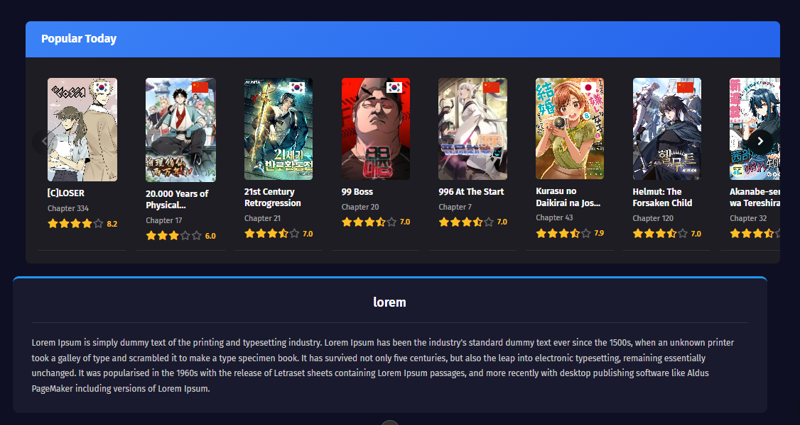
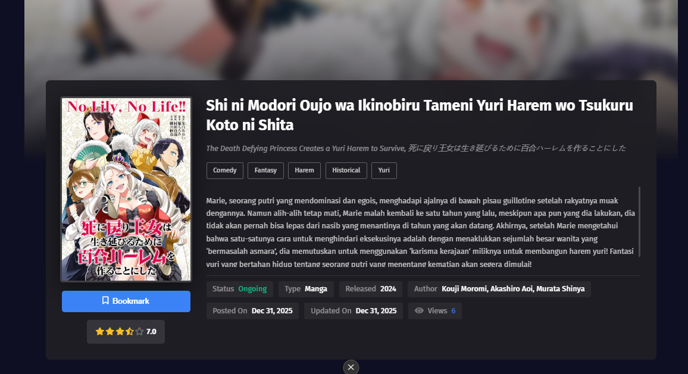
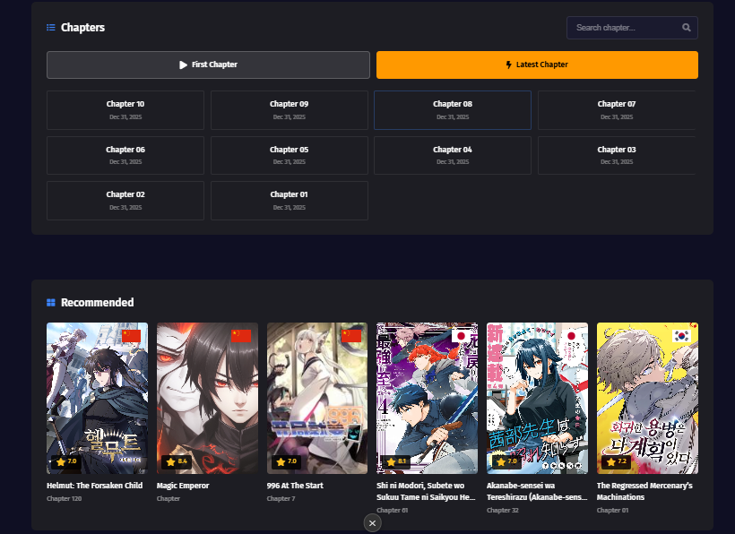

<p align="center">
  
  
  
  
</p>

<h1 align="center">📚 MangaZen - WordPress Manga/Manhwa Platform</h1>

<p align="center">
  <strong>A complete WordPress solution for creating professional manga, manhwa, and webtoon reading websites.</strong>
</p>

<p align="center">
  <a href="#-features">Features</a> •
  <a href="#-screenshots">Screenshots</a> •
  <a href="#-installation">Installation</a> •
  <a href="#-documentation">Documentation</a> •
  <a href="#-license">License</a>
</p>

---

## 🌟 Overview

**MangaZen Platform** is a comprehensive WordPress ecosystem consisting of a beautifully designed dark theme and two powerful plugins, designed specifically for manga/manhwa/webtoon reading websites. Perfect for building professional comic reading platforms with modern UI/UX and robust content management.

### 📦 What's Included

| Component             | Description                                        |
| --------------------- | -------------------------------------------------- |
| 🎨 **MangaZen Theme** | Modern dark theme with zen-like reading experience |
| 📚 **Manhwa Manager** | Complete manga/manhwa content management system    |
| 🤖 **Manhwa Scraper** | Automated content scraping and import tool         |

---

## ✨ Features

### 🎨 MangaZen Theme

<table>
<tr>
<td width="50%">

#### Design & UI

- 🌙 Modern dark theme design
- 📱 Fully responsive layout
- 🎨 Customizable accent colors
- ⚡ Fast loading performance
- 🖼️ Beautiful hero slider
- 📊 Popular Today section

</td>
<td width="50%">

#### User Features

- 👤 User registration & login
- 📖 Bookmark system
- 📜 Reading history
- 🏆 User leveling system
- 💬 Comments with emoji support
- ⬇️ PDF download option

</td>
</tr>
<tr>
<td width="50%">

#### SEO Optimized

- 📈 Schema.org markup
- 🔗 OpenGraph & Twitter Cards
- 🗺️ Breadcrumb navigation
- 📝 Custom meta descriptions

</td>
<td width="50%">

#### Monetization

- 📢 Multiple ad slots (2x2 grid)
- 🎯 Adsterra integration
- 🔗 Direct link ads support
- 💰 Floating ads option

</td>
</tr>
</table>

### 📚 Manhwa Manager Plugin

- ✅ Custom post type for manhwa/manga/manhua
- ✅ Taxonomies: Genre, Author, Artist
- ✅ Chapter management with drag & drop
- ✅ Bulk image upload support
- ✅ External image URL support
- ✅ Rating & view count tracking
- ✅ Status management (Ongoing/Completed/Hiatus)

### 🤖 Manhwa Scraper Plugin

- ✅ Auto-import from multiple sources
- ✅ Bulk import support
- ✅ Image download to local server
- ✅ WebP conversion for optimization
- ✅ Auto-update for new chapters
- ✅ Scraping history & logs
- ✅ Rate limiting & delay settings
- ✅ REST API support

---

## 📸 Screenshots

### 🏠 Homepage - Hero Slider

<p align="center">
  
</p>

_Beautiful hero slider showcasing featured manhwa with stunning cover art and quick info display._

### 🔥 Popular Today Section

<p align="center">
  
</p>

_Horizontal scrollable section featuring today's most popular titles with ratings and chapter info._

### 📋 Latest Updates & Sidebar

<p align="center">
  
</p>

_Clean grid layout showing latest updates with chapter info, alongside bookmarks and popular rankings in the sidebar._

### 📖 Manhwa Detail Page

<p align="center">
  
</p>

_Comprehensive detail page with blurred background effect, cover art, synopsis, genre tags, and metadata._

### 📑 Chapter List & Recommendations

<p align="center">
  
</p>

_Organized chapter list with search functionality and country flags, plus recommended series section._

---

## 🚀 Installation

### Prerequisites

- WordPress 5.0 or higher
- PHP 7.4 or higher
- MySQL 5.6 or higher
- PHP Extensions: `curl`, `dom`, `libxml`, `json`

### Quick Start

#### Step 1: Download the Repository

```bash
git clone https://github.com/yourusername/mangazen-platform.git
```

#### Step 2: Install Theme

1. Copy the `mangazen` folder to `wp-content/themes/`
2. Go to **Appearance → Themes** in WordPress admin
3. Activate **MangaZen** theme

#### Step 3: Install Plugins

1. Copy `manhwa-manager` to `wp-content/plugins/`
2. Copy `manhwa-scraper` to `wp-content/plugins/`
3. Go to **Plugins** and activate both plugins

#### Step 4: Configure

1. Go to **Settings → Permalinks** and select **Post name**
2. Create required pages (Login, Register, Profile, Bookmark, etc.)
3. Configure theme options at **Appearance → Theme Options**

> 📖 **For detailed installation guide, please refer to each component's README file.**

---

## 📁 Project Structure

```
WP Theme-Plugin/
├── 📁 mangazen/              # WordPress Theme
│   ├── assets/               # CSS, JS, Images
│   ├── inc/                  # PHP includes (SEO, Options, etc.)
│   ├── template-parts/       # Reusable template parts
│   ├── style.css             # Main stylesheet
│   ├── functions.php         # Theme functions
│   └── ...                   # Template files
│
├── 📁 manhwa-manager/        # Content Management Plugin
│   ├── includes/             # Core classes
│   ├── assets/               # Admin assets
│   ├── tools/                # Utility tools
│   └── manhwa-manager.php    # Main plugin file
│
├── 📁 manhwa-scraper/        # Scraping Plugin
│   ├── includes/             # Core classes & scrapers
│   ├── views/                # Admin page views
│   ├── assets/               # Admin assets
│   └── manhwa-scraper.php    # Main plugin file
│
└── 📁 screenshots/           # Demo screenshots
```

---

## 📖 Documentation

Each component includes its own detailed documentation:

| Component      | Documentation                                        |
| -------------- | ---------------------------------------------------- |
| MangaZen Theme | [mangazen/README.md](mangazen/README.md)             |
| Manhwa Manager | [manhwa-manager/README.md](manhwa-manager/README.md) |
| Manhwa Scraper | [manhwa-scraper/README.md](manhwa-scraper/README.md) |

---

## 🎯 Supported Sources (Scraper)

| Source      | URL            | Status        | Language   |
| ----------- | -------------- | ------------- | ---------- |
| Komikcast   | komikcast.io   | ✅ Active     | Indonesian |
| Manhwaku    | manhwaku.com   | ✅ Active     | Indonesian |
| Manhwaland  | manhwaland.com | ✅ Active     | Indonesian |
| Asura Scans | asurascans.com | ⚠️ Not Active | English    |

> ⚠️ **Disclaimer**: The scraper is for personal use only. Please respect copyrights and terms of service of source websites.

---

## 🤝 Contributing

Contributions are welcome! Please feel free to submit a Pull Request.

1. Fork the repository
2. Create your feature branch (`git checkout -b feature/AmazingFeature`)
3. Commit your changes (`git commit -m 'Add some AmazingFeature'`)
4. Push to the branch (`git push origin feature/AmazingFeature`)
5. Open a Pull Request

---

## 📄 License

This project is licensed under the **GNU General Public License v2 or later** - see the [LICENSE](LICENSE) file for details.

---

## 💖 Credits

- **Font Awesome** - Icons
- **Google Fonts** - Fira Sans, Roboto
- **WordPress** - Platform

---

<p align="center">
  <strong>⭐ If you like this project, please give it a star! ⭐</strong>
</p>

<p align="center">
  Made with ❤️ for the Manga/Manhwa community
</p>

<p align="center">
  <strong>MangaZen</strong> - Zen-like Reading Experience 🧘‍♂️
</p>
